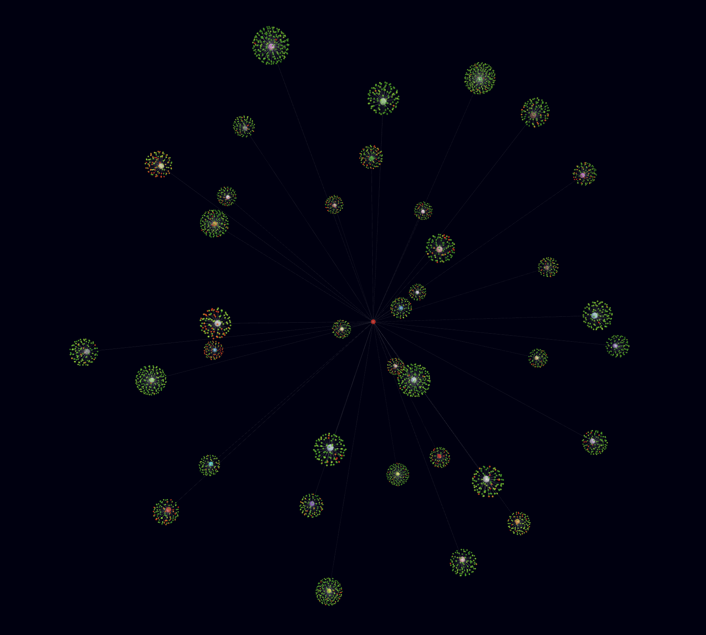

TweetViz.ai
=======================

<p align="center">
     
</p>

A Flask application featuring a data visualization tool for real-time analysis of Twitter trends data, including sentiment analysis. To do so, i used a roBERTa-base model trained on ~58M tweets and finetuned for sentiment analysis with the TweetEval benchmark. You can find the 🤗 page of the model [here](https://huggingface.co/cardiffnlp/twitter-roberta-base-sentiment).
The tool also showcases a dynamic web component utilizing a [force-directed graph](https://en.wikipedia.org/wiki/Force-directed_graph_drawing) iterative layout to represent each trend within a 3-dimensional graph structure (D3.js) !

## Quick start
To get started with this project, follow these steps:

```
$ git clone https://github.com/thomaschlt/tweetViz.ai.git
$ cd tweetViz.ai (if you are not into the folder)
$ cd flaskapp 
```

Then once you are in the 'flaskapp' folder, you will need to install a virtual environment on your computer, follow these steps : 

1. Install python3 on your computer if needed : (https://www.python.org/downloads/)
2. 
```python3 
$ python3 -m venv env
$ pip3 install -r requirements.txt
$ source env/bin/activate (on MacOS or Linux) 
$ .\env\Scripts\activate (on Windows)
```
Then, run the project and enjoy! 
```
$ flask run
```
To launch the web application, simply click on the development server link provided in your terminal.
